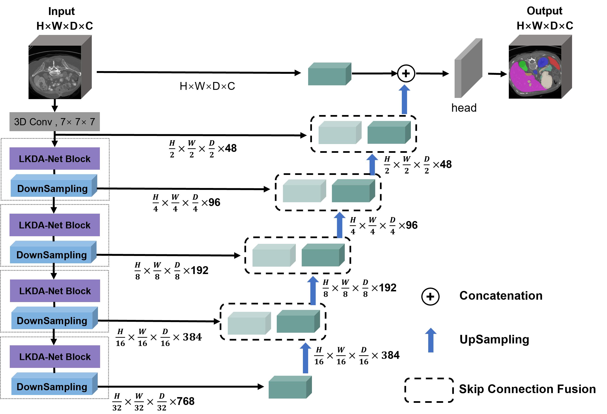
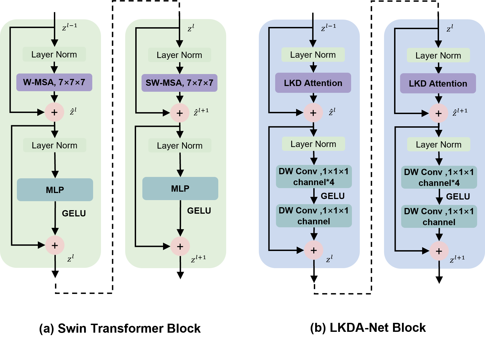

# LKDA-Net: 基于大核深度可分离卷积注意力的高效3D医学图像分割模型


LKDA-Net 是一种轻量化的3D医学图像分割网络，通过 **大核深度可分离卷积注意力（LKD Attention）** 和 **跳跃连接融合模块**，在降低计算复杂度的同时实现高精度分割。本仓库提供完整的训练、推理及可视化代码。

We propose a lightweight three-dimensional convolutional network, LKDA-Net, for efficient and accurate three-dimensional volumetric segmentation. This network adopts a large-kernel depthwise  convolution attention mechanism to simulate the self-attention mechanism of Transformers. Firstly, inspired by the Swin Transformer module, we investigate different-sized large-kernel convolution attention mechanisms to obtain larger global receptive fields, and replace the MLP in the Swin Transformer with the Inverted Bottleneck with Depthwise Convolutional Augmentation to reduce channel redundancy and enhance feature expression and segmentation performance. Secondly, we propose a skip connection fusion module to achieve smooth feature fusion, enabling the decoder to effectively utilize the features of the encoder. Finally, through experimental evaluations on three public datasets, namely Synapse, BTCV and ACDC, LKDA-Net outperforms existing models of various architectures in segmentation performance and has fewer parameters.


## 主要特性
- 🚀 **高效全局建模**：使用级联大核深度卷积（5×5×5和7×7×7）替代Transformer自注意力，参数量减少23%，推理速度提升2倍。
- 🧩 **模块化设计**：支持灵活替换编码器/解码器模块，适配不同医学图像任务。
- 📊 **多数据集**：已在Synapse、BTCV、ACDC等公开数据集验证，Dice系数（DSC）领先SOTA模型。


<p align="center">Overview of the LKDA-Net Architecture

</p>

<p align="center">left figure: Architecture of the Swin Transformer Block. r figure:  Architecture of the
LKDA-Net Block proposed by us. 

</p>

-  We propose the LKDA-Net, which is a lightweight convolutional network for three-dimensional medical image segmentation based on the LKDA-Net Block. The LKDA-Net Block explores large-kernel convolution attention mechanisms of different sizes to obtain a larger global receptive field. In addition, we design and use the Inverted Bottleneck with Depthwise Convolution Augmentation to replace the multi-layer perceptron (MLP) to enhance the expression of channel features, so as to reduce the number of parameters and improve the segmentation performance.
-  We propose a skip connection fusion module to achieve smooth feature fusion, enabling the decoder to effectively utilize the feature information obtained by the encoder and optimize the feature processing effect.
-  We evaluated the segmentation performance of our LKDA-Net on three public datasets and provided visual analysis and parameter quantity comparison. The experimental results demonstrate that our model outperforms current models with various architectures in terms of performance and has significantly fewer parameters. 


## 安装步骤 & Quick Start

### 环境依赖 
- Python 3.8+
- PyTorch 1.12+
- CUDA 11.3+
- 其他依赖库：见requirements.txt
```
git clone https://github.com/zouyunkai/LKDA-Net.git
cd LKDA-Net
pip install -r requirements.txt
```
###  Training

#### Synapse Multi-Organ Dataset:

Download data from Synapse and extract to data/Synapse.
Run preprocessing:
```
python LKDA-Net\load_datasets_transforms.py  - dataset synapse -root ./data/Synapse
```

LKDA-Net training on Synapse with a single GPU:
```
python main_train.py --root LKDA-Net\ --output output_folder_path \
--dataset synapse --network LKDA_net --mode train --pretrain False \
--batch_size 1 --crop_sample 2 --lr 0.0001 --optim AdamW --max_iter 40000 \ 
--eval_step 500 --gpu 0 
```

## Results 
### on Synapse dataset
| Methods        |  Spl  |  RKid |  LKid |  Gal  |  Liv  |  Sto  |  Aor  |  Pan  | DSC(\%) |
|----------------|:-----:|:-----:|:-----:|:-----:|:-----:|:-----:|:-----:|:-----:|:-------:|
| U-Net          | 86.67 | 68.60 | 77.77 | 69.72 | 93.43 | 75.58 | 89.07 | 53.98 |  76.85  |
| TransUNet      | 85.08 | 77.02 | 81.87 | 63.16 | 94.08 | 75.62 | 87.23 | 55.86 |  77.49  |
| Swin-Unet      | 90.66 | 79.61 | 83.28 | 66.53 | 94.29 | 76.60 | 85.47 | 56.58 |  79.13  |
| UNETR          | 85.00 | 84.52 | 85.60 | 56.30 | 94.57 | 70.46 | 89.80 | 60.47 |  78.35  |
| MISSFormer     | 91.92 | 82.00 | 85.21 | 68.65 | 94.41 | 80.81 | 86.99 | 65.67 |  81.96  |
| Swin-UNETR     | 95.37 | 86.26 | 86.99 | 66.54 | 95.72 | 77.01 | 91.12 | 68.80 |  83.48  |
| 3D UX-NET      | 95.01 | 85.76 | 87.59 | 67.34 | 94.82 | 80.01 | 90.72 | 80.71 |  85.26  |
| nnFormer       | 90.51 | 86.25 | 86.57 | 70.17 | 96.84 | 86.83 | 92.04 | 83.35 |  86.57  |
| LKDA-Net(Ours) | 95.63 | 87.08 | 87.39 | 71.08 | 96.64 | 85.30 | 92.67 | 81.86 |  87.21  |

 
### on acdc dataset
 | Methods        |  ACDC |       |       |                 |
|----------------|:-----:|:-----:|:-----:|:---------------:|
|                |   RV  |  Myo  |   LV  | Average DSC(\%) |
| U-Net          | 87.10 | 80.63 | 94.92 |      87.55      |
| TransUNet      | 88.86 | 84.54 | 95.73 |      89.71      |
| Swin-Unet      | 88.55 | 85.62 | 95.83 |      90.00      |
| UNETR          | 85.29 | 86.52 | 94.02 |      88.61      |
| MISSFormer     | 86.36 | 85.75 | 91.59 |      87.90      |
| nnFormer       | 90.94 | 89.58 | 95.65 |      92.06      |
| LKDA-Net(Ours) | 91.75 | 90.60 | 96.02 |      92.79      |

 ### on acdc dataset
 
| Methods        |  Spl  |  RKid |  LKid |  Gal  |  Eso  |  Liv  |  Sto  |  Aor  |  IVC  |  PSV  |  Pan  |  RAG  |  LAG  | DSC(\%) |
|----------------|:-----:|:-----:|:-----:|:-----:|:-----:|:-----:|:-----:|:-----:|:-----:|:-----:|:-----:|:-----:|:-----:|:-------:|
| U-Net          | 90.68 | 82.62 | 85.05 | 57.33 | 70.11 | 93.44 | 73.14 | 84.54 | 77.33 | 70.17 | 65.06 | 65.95 | 62.25 |  75.21  |
| nnUNet         | 95.95 | 88.35 | 93.02 | 70.13 | 76.72 | 96.51 | 86.79 | 88.93 | 82.89 | 78.51 | 79.60 | 73.26 | 68.35 |  83.16  |
| TransUNet      | 94.55 | 89.20 | 90.97 | 68.38 | 75.61 | 96.44 | 83.52 | 88.55 | 82.48 | 74.21 | 76.02 | 67.23 | 67.03 |  81.31  |
| UNETR          | 90.48 | 82.51 | 86.05 | 58.23 | 71.21 | 94.64 | 72.06 | 86.57 | 76.51 | 70.37 | 66.06 | 66.25 | 63.04 |  76.00  |
| Swin-UNETR     | 94.59 | 88.97 | 92.39 | 65.37 | 75.43 | 95.61 | 75.57 | 88.28 | 81.61 | 76.30 | 74.52 | 68.23 | 66.02 |  80.44  |
| MedNext        | 95.59 | 88.76 | 92.87 | 66.42 | 75.52 | 95.81 | 76.87 | 88.52 | 82.01 | 76.21 | 76.82 | 70.31 | 66.53 |  80.94  |
| nnFormer       | 94.58 | 88.62 | 93.68 | 65.29 | 76.22 | 96.17 | 83.59 | 89.09 | 80.80 | 75.97 | 77.87 | 70.20 | 66.05 |  81.62  |
| LKDA-Net(Ours) | 95.97 | 91.21 | 93.71 | 70.54 | 77.07 | 96.84 | 86.14 | 89.02 | 83.07 | 77.92 | 78.41 | 73.45 | 68.64 |  83.23  |

